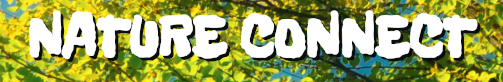

# Nature Connect

Nature Connect is a web application take on the classic connect four game!

## Motivation

This project was built for a 2-day hackathon and grew out of our desire to expand our javascript skills while making a simple game with a clear Nature theme.

## Usage

To add more depth to our connect 4 game we programmed a simple AI to enable single player play. Single player mode is the default, and prospective players only need to select their token choices before clicking the start button!

## Project

View this project live [HERE](parkerrebensdorf.com/natureConnect/)

## Features

- [x] Single And Multiplayer Modes
- [x] Single Player Ai
- [x] Design made for Desktop and Mobile use

## Technologies Used

- [JavaScript](https://www.javascript.com/)
- [HTML5](https://developer.mozilla.org/en-US/docs/Web/Guide/HTML/HTML5)
- [CSS3](https://www.w3.org/Style/CSS/Overview.en.html)
- [Jquery](https://jquery.com/)

## Contributors

[pdrx91](https://github.com/pdrx91) |
[Briantmorr](https://github.com/Briantmorr) |
[bylizhang](https://github.com/bylizhang) 

## License
This project is licensed under the MIT License © [Parker Rebensdorf](parkerrebensdorf.com)